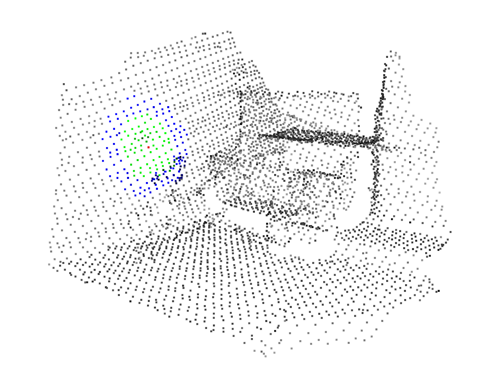
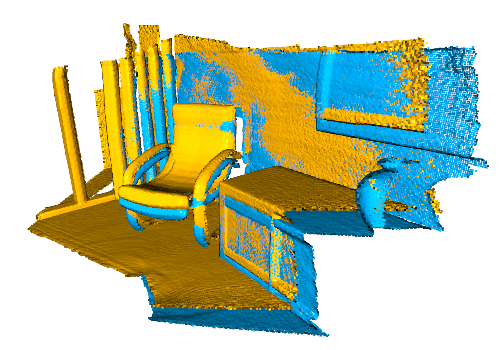

## The Open3D tutorials in C++
I wrote this tutorial to help you get started with Open3D using C++.

The original tutorial is [here](http://www.open3d.org/docs/latest/tutorial).
That was writen in Python.

The topics are:
+ How to config cmake with open3D
+ PCL with open3D
+ Image
+ Transformation
+ RGB-D image
+ RGB-D odometry
  
+ Geometry primitives

+ KDTree 
 

+ ICP registration
 

