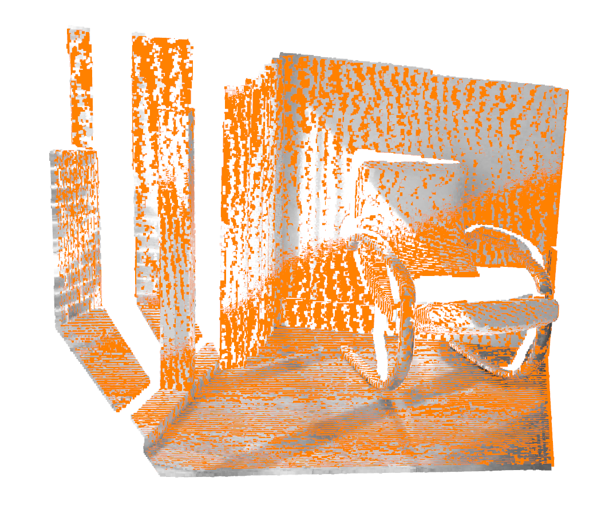

## This is an Open3D tutorial in C++
providing by Open3D tutorial in Python
> http://www.open3d.org/docs/latest/tutorial
+ How to config cmake with open3D
+ PCL with open3D
+ Image
+ Transformation
+ RGB-D image
+ RGB-D odometry
  

